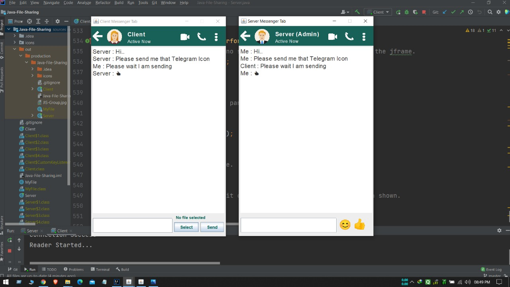
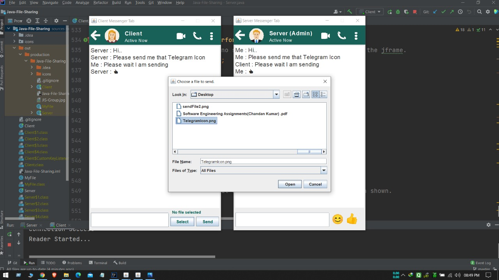

## CHAT AND FILE TRANSFER APPLICATION USING SOCKET PROGRAMMING

------------

This application software is designed and developed by [Chandan](https://github.com/ChandanKrv "Chandan") and group, 
under guidance of Ananya mam.

- **College: NiT**
- **Stream: Computer Science Engineering**
- **Subject: Computer Network Lab**
- **Language: Java (Swing, AWT)**
- **Year/Sem: 3rd/6th**
- **Date: 25/05/2021"**

